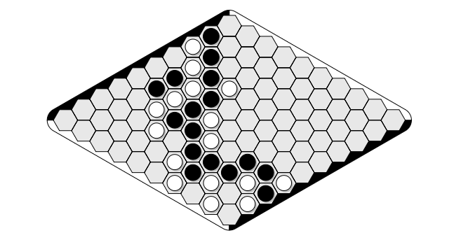

<!-- # Portfolio
An overview of my student &amp; personnal projects  -->

* TOC
{:toc}

# Cleaning and classification of hand-written job titles

SypherAI is a french start-up selling a Saas CRM managing tool. Its tool is capable of cleaning and retriving missing info among potential clients, and sorting them using Machine Learning on previous sales to identify the ones most likely to buy.
The job title is one of the most critical information for the ML algorithm. 

Our mission was to provide a pipeline capable of **cleaning and classifying hand-written job titles** previously extracted from LinkedIn and similars.

## The mission further explained

Job titles, when hand-written as they are on LinkedIn, can vary a lot even for same or similar work positions, sometimes to the point of being almost obscure.
A simple exemple might be the possible job titles for an HR manager. People can describe themselves as "Head of HR", "Recruiting manager", but also "Talent Acquisition" or even "Head hunter". Although thoses variations might convey slightly different meanings, they are not relevant for our case (identifying propects) and keeping them as is can be detrimental for the efficiency of the ML algorithm. 

Our solution should then categorize all of these titles as a single 'HR manager' in order to be fed to the algorithm.
Since the variations for a single title can be almost endless, our pipeline should use a natural language processing model in order to extract the semantics of the title rather than doing a simple matching, which would be fastidious and prone to fail.

  
  
  
  
  
<em>A variety of HR manager related jobs titles</em>

## How the mission went & my contribution

Between all the NLP models we tested, we selected the DeBERTa-ZeroShot for its great precision and ability to deal well with rare or unique titles, thanks to its semantic capabilities which makes it significantly more resilient than a classic supervised classification model. An active learning approach was also considered as it would make up for the eventual imprecisions of a model over time, but early results showed it inconclusive compared to DeBERTa so it was discontinued.

One of the main issue was the identification of target categories, initialy dealt with by using the International Labour Organization classification table ; but as this turned out to be a much wider challenge than the original issue, it was decided in accordance with SypherIA that they would be supplied by the pipeline user. Indeed interesting prospects usually belong in a specific job category, already identified by the sales manager using the CRM manager.

One of the key technical solution which drasticly improved models results was the choice to perform two classifications instead of one. One on the job level (Senior, Junior, Manager, Director, etc) and one on the job departement (HR, Sales, IT, Production, etc). It greatly reduced models confusion between the level part of the title and the departement, which could sometimes lead things like 'Head IT manager' to be associated with 'HR manager'.

After training some more basic models (the likes of FastText, BERT) to have a performance baseline, I personnally choose performance criterias to design a benchmark helping us in our model choice, and motivated this choice to the client. I also proposed multiple of the ideas cited above to resolve limitations, including the ILO table and the 2-level classification (originating from a tree-like classification idea, simplified into 2 levels).

This project allowed me to get familiar with main models and methods to apprend Natural Language processing, aswell as communicating and delivering a project to a client, which was my first mission of this type.

## What we delivered

We delivered to SypherIA a fully working and ready to transfert Python code containing our model, paired with a GUI to make using our pipeline easier.

The main objective of this projet was to reduce manual classification as much as possible, and is a success in this regard as for a 1000+ client list, only a handful of low-confidence job titles might need correction.

Due to confidentiality, I am unable to disclose any code, dataset or app produced in this mission.
You can however find below a short video presentation of our GUI.

  <video style="width: 100%; height: auto;" controls>
    <source src="videos/demo.mp4">
  </video>

This mission was done as part of a team of 5 people.

## Keywords 

NLP, ZeroShot, Classification, ML

# Game of Hex Computer Player

Fully written in Ocaml, and build using Dune, I made my own implementation of an Hex computer player. It uses various elements of Game theory to try to achieve the best performances, including an optimized version of the Alpha-Beta algorithm, with move ordering and pruning developed specifically for this game. This project was presented as a Computer Science research work (TIPE) during the competitive exams for entry in top french engineering schools.

## The game of Hex

The game of Hex is of disputed paternity : often credited to Nash, which would have created it in 1948 during his time at Princeton University, it is also said to be related to the danish mathematician Piet Hein in 1942 while he was looking for a counter-exemple for the four color theorem. Whoever the creator was, it is a truly a highly mathematical game, and despite its simple rules it hides plenty of elegant properties.

The said rules are as follow :
Each player own two opposites sides of the hexagonal board, and the goal is to link them with stones placed in the hexes, alterning with the other player.

  
  
<em>A 10x10 hex board where black has won</em>

We can prove that there exist a unique winner for each game of Hex (= no draw or situation of no winner).

The Game of Hex is a very challenging game to try and solve algorithmically, due to its huge branching factor in large boards which size up to 19x19. It has in this regard often been compared to the Game of Go (the calculation for the branching factor being exactly the same), and has largely benefited of the research done to build efficient player at Go. MoHex, the best player at the time of this project, is heavily inspired from MoGo and AlphaGo.

## The player

To develop this player I took inspiration from the first performant computer hex player, Hexy, developed in 1998 by Vadim V. Anshelevich.
His approach, in opposition to following computer players, doesn't solely rely on highly optimized Alpha-Beta or Monte-Carlo searches but rather on intrinsic game properties to gain information on future plays. His approach teaches a lot about Hex game theory and paved the way for future computer players. Although he describes the general idea here, there is still room for plenty of personnal initiative, as it was the case here.

My player therefore couples an Alpha-Beta Search with an heuristic called H-SEARCH, which reveals future connections accross the board. This info, which acts like predicting future plays without pushing the Alpha-Beta depth search too far, is then used to evaluate the board position. This heuristic uses induction rules and properties used when connecting two hexes during a game to build a network of possible future connections. An in-depth explanation to the theory is availaible in the dedicated repo.

This methods gives the computer player great insights, allowing it to make relevant plays and correctly identifying critical region of the board. 

This info however comes at a great time cost, so multiples optimizations had to be put in place to make the player usable, including a dynamic update of the H-SEARCH, a move-ordering and situational pruning, and implementation of a Iterative Depth First Search for the Alpha-Beta, to time-restrict the player.

The technical implementation uses a variety of strutures offered by the Ocaml language to make the algorithm as efficient as possible, including sets or hash tables.

## Results & Code

My implementation did not match the one made by Vadim V. Anshelevich, as it suffered from long calculation times, even with the optimizations, and could then hardly work with the original parameters. However by the quality of its plays it showed how relevant searching for game properties can be to replace brute game-tree searching. 

The full code of the player is available in the following repo, along with a (french) report which goes in depth in the theoretical details of the implementation : 

[github.com/Pvi05/HexPlayer](https://github.com/Pvi05/HexPlayer)

I highly recommend the game of Hex for anyone interested in Computer and Game theory, as its properties makes it an excellent study case for computer player algorithms, and a great game to try overall.

This project was presented to the jury of the Tétraconcours (CentraleSupelec, Mines, CCINP) and the ENS de Paris, where it was graded respectively 18,5 and 16 out of 20 (both A+s).

# Python automata game with water physics

Inspired by the working of automaton games like the game of life, we builded an automaton game on python with a strong accent on water physics called "La-haut" and inspired by disney's "Where is my Water" mobile game. This was done in a single week as a team of 6.

## The Game

You are given a water source and a drain, and your goal by placing stone or removing it is to direct the water from the source to the drain. The gameplay diversifies by adding multiple elements with various properties, such as plants (which grows and absob water), obsidian (indestructible with the base tool), dynamite (to break obsidian on a limited area), and more...

  
  
<em>One of the levels of the game</em>

Using Agile developpement, we created the basic elements of gameplay at first, and then iteratively improuved on the previous version, by adding new blocks, changing water physics, creating levels, etc.

The water physics is a great achievement as it uses clevers tricks with block types to be able to achieve such physics using a simple automaton (which does not remember history, and only use previous state to determine present state). 

The game also include a random level option, which reuses a modified Game of Life automaton to generate block strutures.

I was personnally in charge of the graphical interface using PyGame, which included front-end for player to use, such as options items or level vizualisation. It also included creating from scratch a visual level editor which allowed us to be much more creative when designing levels (than to be stuck with a matrix). This functionnal level-editor could almost with minimal work be given to the player to create its own levels, but this was not done due to time-constraint.

With this project I had the chance to experience agile development in a one-week intensive coding session and made me familiar with Python Object oriented programming, which I had only done in C or Ocaml before. It also mobilized communication skills, to present our work and even to organize work within the group, which was composed of a very diversified team of student, some not interested in development originally.

## The Code

As it is a student one-week sprint challenge, the game is not technically in perfect shape to consider publishing it, but close enough with the main mecanics in place and a presentable user interface. 

The code is stored in the following repo :

[github.com/Pvi05/La-haut](https://github.com/Pvi05/La-haut)

# Smaller Side-projects

## Non-zenoness proving algorithm

When proving programs and using timed automata, non-zenoness is a crucial propriety to ensure realistic behavior for our models.
An automata (which models a program or a system) is zeno when there is the possibility for infinite actions in finite time, ie the automata loops infinitely rapidely beetween different states. 
Currently UPPAAL, the mainstream program for timed automata model checking, doesn't have a feature to prove the non-zenoness propriety of an automata. Non-zenoness is indeed a delicate property to address, especially when using synchronisation between multiple automata. 

The most direct solution to synchronisation would be to build the composition automata from all automatas, but this poses great concerns regarding complexity, as the number of state of such an automata is exponential. 
Our algorithm uses a sufficient condition for single-automata systemswhich is extended to multiple automata synchronisation by checking couples of loops in relation by one synchronisation. It does not provide for sufficient and necessary condition, but does highlight loops at risk of being zeno, affrim the non-zenoness of a system if no such loops is found.

This program was done as a side part of a different project regarding checking properties af a aircraft TCAS system ; and was completed alone in one day as a algorithmic challenge. I had great time doing it as I'm always up for a coding challenge, especially when linked to Computer Theory (although here it involded a lot of xml parsing as well).

This project can be found here :

[github.com/Pvi05/Non-zenoness-checker](https://github.com/Pvi05/Non-zenoness-checker)

## Scraping Bot for Centrale student rooms

CentraleSupelec is suffering of student housing shortage, and finding an accomodation on campus can therefore become challenging, especially for 2nd year student. To deal with this problem, I build a bot capable of warning the user through discord of a free rooms available. This bot uses Selenium to scrap the info on the student housing website (Césal), with clever cookie management to handle captchas, and if needed sends a message in private through discord to warn of available rooms.

Project can be found here :

[github.com/Pvi05/Cesal_bot](https://github.com/Pvi05/Cesal_bot)

## Survival prediction for foetuses suffering from Congenital Diaphragmatic Hernia

Congenital Diaphragmatic Hernia is a rare disease affecting about 1 in 3000 foetuses, caracterized by a hole in the diaphragm which lead to stomach, liver and other organs to go up the thorax and compress heart and lungs. Depending on the gravity and time of the disease, this can cause lung and heart development issues, potentially leading to foetus death in the most serious cases. Specialist uses ultrasound and IRM to assess the disease and potentially schedule a operation to compensate the effect on lungs. They are usually confident of the foetus survival rates, but are much less able to tell if the feotus is going to have to live permanently with a breathing aid, or if just a few month in close surveillance might be needed. Since this information is crucial for parents in their decision to keep the baby, APHP and the Kremlin-Bicêtre hospital lab, France reference center for the disease, have come forward and asked us to train models on their data to see if it could improve prediction capability.

This project is currently underway and managed by a team of 5.

Due to confidentiality I am unable to disclose any code or dataset regarding this mission.